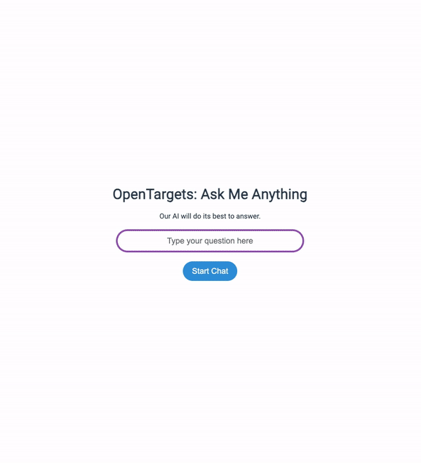

# Chat with OpenTargets Web Interface and CLI

## Demo


Check out the web interface for Chat with OpenTargets ([Youtube](https://www.youtube.com/watch?v=AVcRzQQW0Sg)).
[](https://www.youtube.com/watch?v=AVcRzQQW0Sg "Screen Recording of Chat with OpenTargets Web")


View the screen recording of Chat with OpenTargets CLI ([Youtube](https://www.youtube.com/watch?v=kAf7GuBpOAU)).
[](https://www.youtube.com/watch?v=kAf7GuBpOAU "Screen Recording of Chat with OpenTargets CLI")


The Chat with OpenTargets command line interface (CLI) provides an interactive way to generate and interpret queries to the OpenTargets database using the OpenAI GPT language model. This started out as a project forked from [chatGPT-for-genetics](https://github.com/cx0/chatGPT-for-genetics). Check out their repo for the inspiration. 

## Setup

The setup process involves creating a new conda environment, installing the necessary packages, and setting up the necessary directories for logging.

### Requirements

Make sure you have [conda](https://docs.conda.io/projects/conda/en/latest/user-guide/install/) installed on your machine.

### Steps

1. Download or clone the repository to your local machine.

2. Navigate to the project directory in your terminal.

3. Run the setup script with the command `source setup.sh`. This script does the following:

    - Creates a new conda environment named `chatwithopentargets` with Python 3.11.
    - Activates the new conda environment.
    - Installs the required Python packages as specified in the `setup.py` file. This includes the `click`, `openai`, `flask`, and `flask_cors` packages.
    - Creates directories for log files: `logs/suggestions`, `logs/results`, and `logs/interpretations`.

## Usage

### CLI Usage
After the setup, you can use the `opentargets` CLI tool, which provides the following commands:

- `suggest`: Generates a suggested query for the provided question.
- `complete`: Completes a provided question, generating a query and returning the query result.
- `interpret`: Provides an interpretation of the query result for the provided question.
- `delete-logs`: Deletes all log files in the `logs/suggestions`, `logs/results`, and `logs/interpretations` directories.

You can run `opentargets` followed by any of these commands. For example:

```bash
opentargets suggest "Your question here"
opentargets complete "Your question here"
opentargets interpret "Your question here"
opentargets delete-logs
```

Replace `"Your question here"` with your actual question, enclosed in quotes.

### Web Usage

The web interface can be started using Flask. From the terminal, you can run the command `python chat_serve.py`. This will start the Flask server, which by default will be accessible at `localhost:5001`.

Two endpoints are available:

- `/chat`: This accepts a POST request with a JSON body containing the key `message`. The value of `message` should be the query you want to ask the OpenTargets database. The response will be a JSON object containing the key `response` with the interpreted query result as its value.

- `/delete_logs`: This accepts a POST request and deletes all log files in the `logs/suggestions`, `logs/results`, and `logs/interpretations` directories. The response will be a JSON object containing the key `response` with the value "Deleted all log files".

#### Example of usage with cURL:

```bash
# For chatting
curl -X POST -H "Content-Type: application/json" -d '{"message":"Top 5 targets for prostate cancer"}' http://localhost:5001/chat

# For deleting logs
curl -X POST http://localhost:5001/delete_logs
```

### Running the Web Interface Locally

To run the web interface locally, you'll need to have Node.js and npm installed. Then:

1. Navigate to the project directory in your terminal.
2. Run `npm install` to install the necessary packages for the web interface.
3. Run `npm run serve` to start the Vue.js development server. The web interface will be accessible at `localhost:8080`.

Now, you can interact with the web interface through your web browser. The requests from the web interface will be sent to the Flask server running at `localhost:5001`.

Remember to always run the Flask server (`python chat_serve.py`) before starting the Vue.js development server (`npm run serve`).
