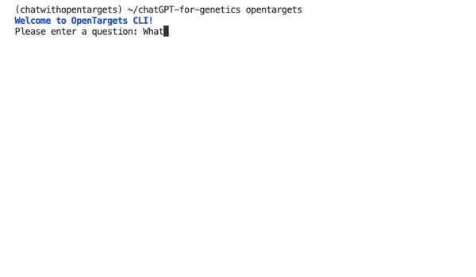

# Chat with OpenTargets CLI

## Demo

View the screen recording of Chat with OpenTargets on [Youtube](https://www.youtube.com/watch?v=kAf7GuBpOAU).

[](https://www.youtube.com/watch?v=kAf7GuBpOAU "Screen Recording of Chat with OpenTargets")


The Chat with OpenTargets command line interface (CLI) provides an interactive way to generate and interpret queries to the OpenTargets database using the OpenAI GPT language model. This started out as a project forked from [chatGPT-for-genetics](https://github.com/cx0/chatGPT-for-genetics). Check out their repo for the inspiration. 

## Setup

The setup process involves creating a new conda environment, installing the necessary packages, and setting up the necessary directories for logging.

### Requirements

Make sure you have [conda](https://docs.conda.io/projects/conda/en/latest/user-guide/install/) installed on your machine.

### Steps

1. Download or clone the repository to your local machine.

2. Navigate to the project directory in your terminal.

3. Run the setup script with the command `source setup.sh`. This script does the following:

    - Creates a new conda environment named `chatwithopentargets` with Python 3.11.
    - Activates the new conda environment.
    - Installs the required Python packages as specified in the `setup.py` file. This includes the `click` and `openai` packages, and makes the `opentargets` CLI tool available.
    - Creates directories for log files: `logs/suggestions`, `logs/results`, and `logs/interpretations`.

## Usage

After the setup, you can use the `opentargets` CLI tool, which provides the following commands:

- `suggest`: Generates a suggested query for the provided question.
- `complete`: Completes a provided question, generating a query and returning the query result.
- `interpret`: Provides an interpretation of the query result for the provided question.
- `delete-logs`: Deletes all log files in the `logs/suggestions`, `logs/results`, and `logs/interpretations` directories.

You can run `opentargets` followed by any of these commands. For example:

```bash
opentargets suggest "Your question here"
opentargets complete "Your question here"
opentargets interpret "Your question here"
opentargets delete-logs
```

Replace `"Your question here"` with your actual question, enclosed in quotes.

## Representative example:

```bash
(chatwithopentargets) chatGPT-for-genetics % opentargets interpret
Please enter a question: Top 5 targets for prostate cancer
Querying the Open Targets API...
The query result provides information about the top 5 targets associated with prostate cancer. Each target is represented by its unique identifier (id), approved symbol, and approved name. The targets are ranked based on their scores, which indicate their relevance or significance in relation to prostate cancer.

The top 5 targets for prostate cancer, according to the query result, are as follows:

1. Target: ENSG00000169083
   Approved Symbol: AR
   Approved Name: Androgen Receptor
   Score: 0.8563968907935317

2. Target: ENSG00000171862
   Approved Symbol: PTEN
   Approved Name: Phosphatase and Tensin Homolog
   Score: 0.8294982223790262

3. Target: ENSG00000139618
   Approved Symbol: BRCA2
   Approved Name: BRCA2 DNA Repair Associated
   Score: 0.8137493155511473

4. Target: ENSG00000183765
   Approved Symbol: CHEK2
   Approved Name: Checkpoint Kinase 2
   Score: 0.81080286658196

5. Target: ENSG00000141510
   Approved Symbol: TP53
   Approved Name: Tumor Protein p53
   Score: 0.7684696851450488

These targets have been identified as having high relevance or involvement in prostate cancer based on their scores. Researchers and medical professionals can further investigate these targets to understand their role in the development, progression, and treatment of prostate cancer.
```